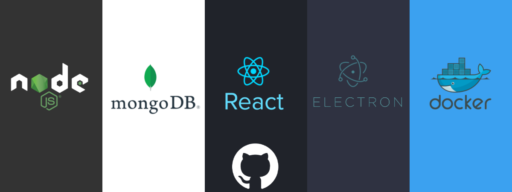

# Fullstack en JavaScript

Este repositorio fue creado para implementar un ejemplo de FullStack en Javascript. En este proyecto se trabajó con:

- [Node.Js](https://nodejs.org/es/)
- [MongoDB](https://www.mongodb.com/)
- [React.js](https://es.reactjs.org/)
- [Electron.js](https://www.electronjs.org/)
- [Docker](https://www.docker.com/)

