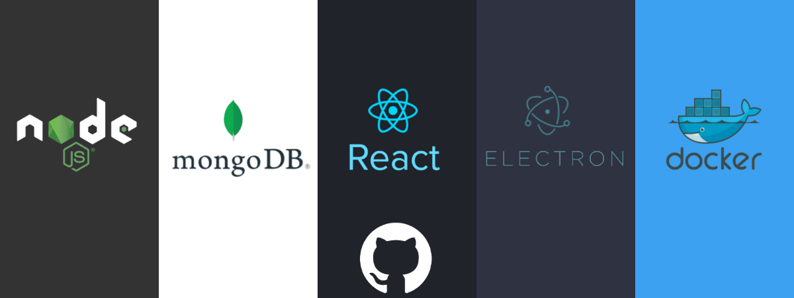

# Docker para Mongodb

Este contenedor solo levanta un servicio de Mongodb, en el archivo docker-compose.yml que se encuentra dentro de la carpeta mongodb puede ver que se levanta en el puerto 27017 y genera un volumen del contenido de la base de datos de esta forma no se perderá la información que ingreses en la base.

## Iniciar el servicio

Para iniciar el servicio primero en tu terminal ingresa a la carpeta donde se encuentra el **docker-compose.yml** y solo ejecuta:
 
`docker-compos up -d`
 
Al levantar el servicio docker creará una carpeta llamada **data** en él se guarda todas las bases de datos para su uso, de esta forma la información no se pierde nunca.

## Detener servicio

Para detener el servicio, en tu terminal dirigente al archivo **docker-compose.yml** y ejecuta:

`docker-compose down`

